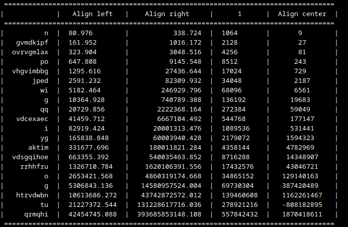
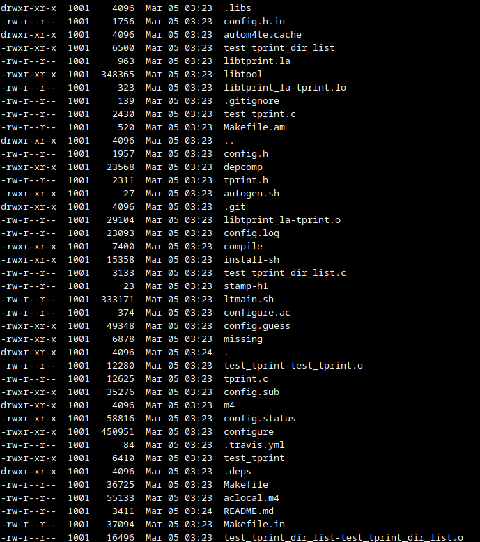

# libtprint

[](https://travis-ci.org/wizzard/libtprint)

TPrint is a simple C library to print ASCII tabular data.

Installation
============
```
sh autogen.sh
./configure
make
make install
```

Usage
=====

(check test_tprint.c for example)

```
#include <tprint.h>
..
TPrint *tp;
tp = tprint_create (..);
tprint_column_add (tp, ..);
..
tprint_data_add_double (tp, ..);
..
tprint_print (tp);
tprint_free (tp);
```

compile:
```
gcc main.c -ltprint `pkg-config --libs --cflags glib-2.0`
```

output examples:



without borders and headers:

